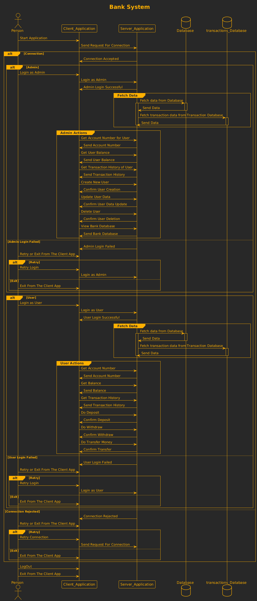
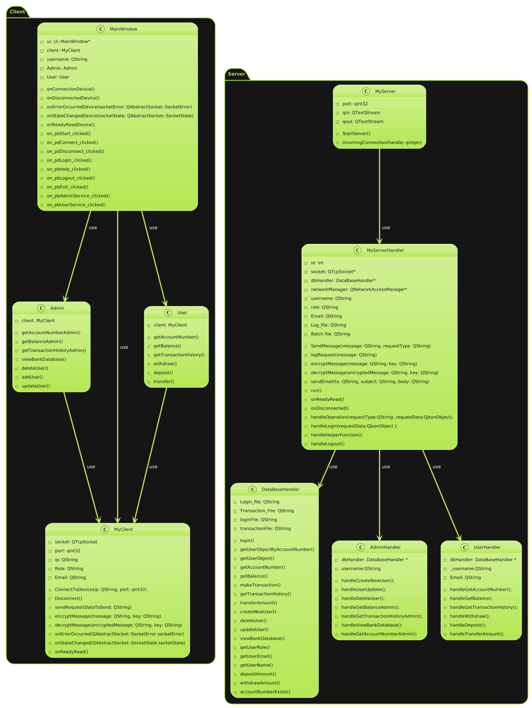
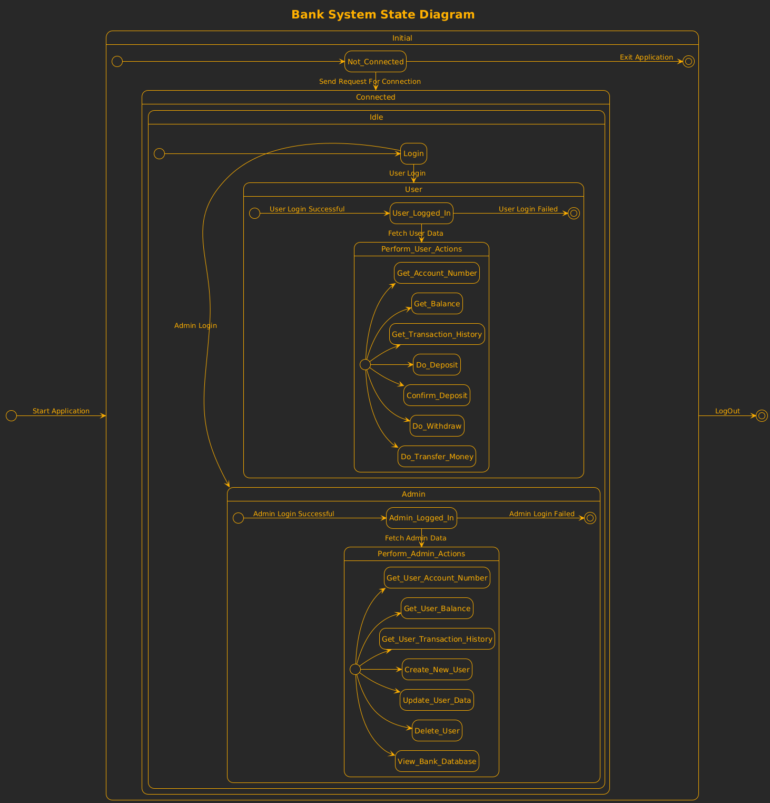

# ITIDA-Final-Project

<<<<<<< HEAD
# ITIDA-Final-Project

=======
>>>>>>> a0d54ff08b62a64581ef1faeca8556a54fb58b58
# Bank System
## Overview
The Bank System is a client-server application designed to manage banking operations. It supports both admin and user roles, providing different functionalities based on the role of the logged-in user. The system handles multiple client requests via sockets and threads, encrypts requests, and includes logging, service integration, and email responses.
## Features
###  Admin Role
 #### • View account numbers for users
 #### • Check user balances
 #### • View transaction history of users
 #### • Create new users
 #### • Update user data
 #### • Delete users
 #### • View entire bank database

###  User Role
#### • View account number
#### • Check balance
#### • View transaction history
#### • Deposit money
#### • Withdraw money
#### • Transfer money

## Architecture
The system follows a client-server architecture. The client application is a GUI application built with Qt/C++, while the server application is a console application handling multiple client requests using threads. The server uses JSON files for user data and logging.
<<<<<<< HEAD

## Sequence Diagram

## Class Diagram

## State Diagram

=======
>>>>>>> a0d54ff08b62a64581ef1faeca8556a54fb58b58
